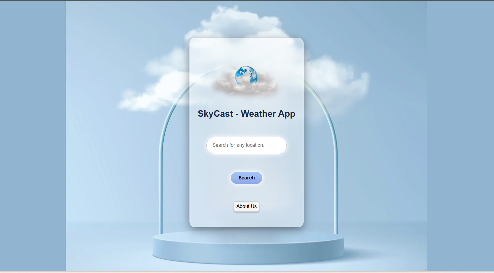
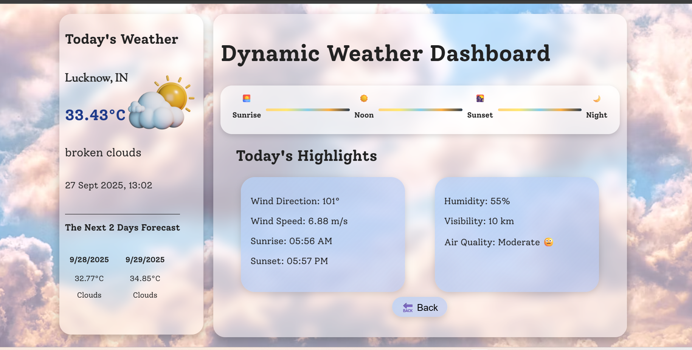

# 🌤️ SkyCast – Dynamic Weather Dashboard

SkyCast is a modern web-based weather dashboard that delivers **real-time, location-specific weather updates** in a clean and interactive interface.  
It integrates live data from trusted weather APIs to provide users with **accurate temperature readings, weather conditions, and short-term forecasts**.

---

## ✨ Features

- 🌎 **Real-time Weather Data** – Get instant updates for any city using live weather APIs.  
- 🌡️ **Detailed Weather Info** – Current temperature, humidity, wind speed, UV index, and air quality.  
- 📅 **Forecasts** – Short-term forecasts to help plan commutes, travel, or daily routines.  
- 🌅 **Daylight Insights** – Sunrise and sunset times at your location.  
- 🎨 **Modern UI** – Glassmorphic design with smooth animations.  
- 📱 **Responsive Design** – Works seamlessly on desktop, tablet, and mobile devices.  
- ⚡ **Fast & Lightweight** – Simple to use without complex navigation.

---

## 📂 Project Structure

skycast/
```
│── index.html # Homepage
│── style.css # Homepage styling
│── index.js # Homepage logic
│── dashboard.html # Weather dashboard page
│── dashboard.js # Dashboard scripts
│── styledash.css # Dashboard styling
│── about.html # About page
│── about.css # About page styling
│── citynotfound.html # Fallback page for invalid city
│── images/ # Icons, backgrounds, assets 
```

---

## 🛠️ Tech Stack

- **HTML5** – Structure
- **CSS3 (Glassmorphic UI)** – Styling & animations
- **JavaScript (ES6)** – Functionality & API integration
- **Weather API** – Live data source
- **GitHub Pages** – Hosting

---

## 👩‍💻 Author

- SkyCast Project by **Pragati Awasthi** 
- ⭐ If you like this project, don’t forget to star the repo!

---

## 📸 Screenshots

### Homepage


### Dashboard

